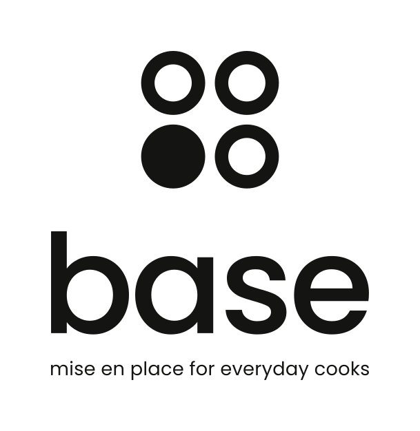

<p align="center">
  
</p>

# Base

**Mise en place for everyday cooks.** Base is a weekly, seasonal foundation of ingredients — chosen by a research engine, prepped and portioned into reusable glass containers, and picked up locally. Base provides the foundation, not the finished meal: what you cook with it is up to you.

This repository is the working prototype: a premium storefront and the SQLite research engine behind it, for the Vancouver / British Columbia region.

> **Prototype.** Nothing can be bought. Prices, nutrition and seasonality are *estimates*; suppliers, pickup locations, add-on prices, container pricing and recipe creators are *demo* placeholders. The site labels every number with its verification state.

## The four layers

| Layer | What it is | Where |
| --- | --- | --- |
| **Foundation** | The weekly Base: 12 seasonal, affordable, versatile ingredients selected by the research engine. Useful on its own. | `/base`, `/baskets` |
| **Expression** | Optional add-ons — premium proteins, sauces, spice blends, specialty and seasonal treats. Base is enough; Expression makes it yours. | `/addons` |
| **Community** | Recipes built around this week's ingredients, so there's always an idea for what to make. (Demo creators.) | `/recipes` |
| **Pickup + containers** | A local pickup where you collect your Base, return last week's containers and see what's in season. | `/pickup` |

The weekly cycle — plan, explore, reserve, prepare, pick up, batch-prep, cook, share, return, repeat — is on `/how-it-works`.

## Quick start

Requires **Node 22.18 or later** (for built-in TypeScript type stripping and `node:sqlite`). No API keys or external services.

```bash
npm install
npm run build      # migrate → seed → rank → baskets → validate → export → prerender to dist/
npm run preview    # serve dist/ at http://localhost:4173
```

For development, `npm run dev` rebuilds on change and serves at http://localhost:5173.

Copy `.env.example` to `.env` (or export the variables) to pin the week the pipeline plans for:

```bash
BASE_WEEK_OF=2026-10-05 npm run build
```

## Commands

| Command | What it does |
| --- | --- |
| `npm run db:migrate` | Apply `db/migrations/*.sql` (`-- --fresh` deletes the database first) |
| `npm run db:seed` | Load sources, ingredients, nutrition, prices, price history, seasonality, use cases, add-ons, recipes, containers and pickup locations |
| `npm run db:reset` | Fresh migrate + seed |
| `npm run research:rank` | Compute the five scores, the Base Score and the classification for every ingredient for all 12 months |
| `npm run research:baskets` | Build last, this and next week's Base, a plant-forward variant and seasonal previews; plan containers, add-ons and recipes |
| `npm run research:report` | Run the nine ranking queries in `db/queries/rankings.sql` and print the answers |
| `npm run data:validate` | Fail if any external datum lacks a source or verification state, or if derived data is inconsistent |
| `npm run data:export` | Write `src/data/generated/snapshot.json` for the storefront |
| `npm run data` | Reset, rank, build baskets, validate and export, in order |
| `npm run typecheck` | `tsc --noEmit` |
| `npm test` | Unit, database and rendering tests (`node:test`) |

## Database

SQLite via Node's built-in `node:sqlite`, at `db/base.sqlite` (git-ignored; rebuilt by `npm run data`).

- `001_initial_schema.sql` — sources, suppliers, ingredients, unit conversions, nutrition, prices, price history, seasonality, use cases, baskets and items, add-ons, recipes (steps, ingredients, basket links), containers, pickup locations and windows, derived scores, research runs. `CHECK` constraints enforce verification states, units, CAD currency and positive prices.
- `002_container_accounts.sql` — member container balances.
- `003_research_views.sql` — price per kg and cost per serving views.

Seeds live in `db/seeds/`: 59 ingredients, 8 sources, 9 demo suppliers, 29 use cases, 17 add-ons, 16 recipes, 4 container sizes and 2 demo pickup locations.

## Research engine

The Base Index scores every ingredient 0–100 on **affordability** (30%), **versatility** (25%), **nutrition density** (20%), **seasonal availability** (15%) and **price stability** (10%), then classifies it as **Foundation**, **Supporting** or **Expression**. The weekly basket builder fills twelve slots (protein, everyday protein, legume, grain, two aromatics, greens, three vegetables from distinct families, fresh flavour, flavour builder) with in-season, non-Expression ingredients, applies a rotation penalty against last week, a peak-season bonus, a storage rule, a signature-vegetable rule and a budget, and records a reason for every pick.

Everything is deterministic and documented in **[docs/methodology.md](docs/methodology.md)**, which is also linked from the site's Research pages.

## Provenance

Every external datum has a source and one of four states, shown as a badge wherever it appears:

- **Verified** — checked against the cited source value by value. *Nothing is verified yet.*
- **Estimated** — a documented estimate (prices, nutrition, seasonality, use cases).
- **Base-derived** — computed by Base (scores, baskets, costs).
- **Demo** — placeholders (suppliers, price history, add-on prices, containers, pickup, recipe creators).

`npm run data:validate` and the test suite fail if provenance goes missing. There are no fake reviews, ratings, testimonials or savings claims, and the reserve button is labelled *Reserve pickup — prototype*.

## Containers

Four reusable glass sizes, planned per ingredient (cooked legumes at 2.4× dry weight; dairy in jars). Customers can **borrow** (refundable deposit, shown separately from the food price), **own** (one-time purchase) or **return** last week's set. Oven, freezer and dishwasher ratings are pending a final specification, so the site makes no such claims. See **[docs/containers.md](docs/containers.md)**.

## Storefront

Pages: `/`, `/base`, `/baskets`, `/baskets/:slug`, `/ingredients`, `/ingredients/:slug`, `/recipes`, `/recipes/:slug`, `/addons`, `/pickup`, `/research`, `/research/ingredients`, `/research/data`, `/how-it-works`.

React 19 + TypeScript, prerendered to static HTML at build time and hydrated in the browser. Everything renders without JavaScript; interactivity (filters, sorting, comparison, the Build my Base drawer) arrives with hydration. Accessible by default: semantic landmarks, one `h1` per page, labelled controls, visible focus, a focus-trapped drawer, and `prefers-reduced-motion` respected. Colours shift with the season. Ingredient art is drawn procedurally — no stock photography.

The UI only talks to `src/data/api.ts`, never to SQLite, so a hosted backend can replace the static snapshot without touching the pages. See **[docs/architecture.md](docs/architecture.md)**.

## Testing

```bash
npm test
```

48 tests across cost calculations, servings and plates, score calculations, deterministic ranking (including SQL queries agreeing with the storefront), basket constraints for four seasons, rotation, plant-forward rules, add-on and deposit order summaries, container planning and balances, schema constraints, data validation (provenance cannot silently disappear), and prerendering every route without unsupported claims. Tests build an isolated database in a temp directory with a fixed week, so they don't depend on today's date.

CI (`.github/workflows/ci.yml`) runs typecheck, tests and a full build on every push and pull request.

## What a hosted version needs next

- Verified data: calibrate prices against Statistics Canada 18-10-0245-01, nutrition against the Canadian Nutrient File, seasonality against a BC growers' calendar.
- Real price history in place of the synthetic series.
- An API serving the same `DataSnapshot` shape, plus accounts, reservations and container balances.
- A verified container specification.
- Real supplier relationships and pickup partners — added as data, with their verification states.

## Brand

Logo, wordmark and lockups are in [`brand/`](brand/README.md).
