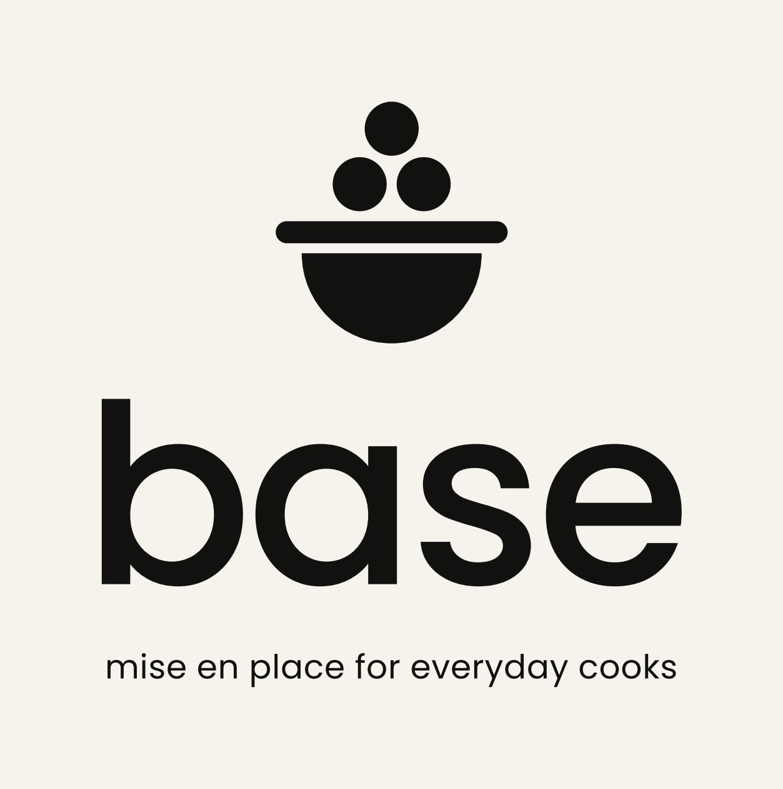

# Base — Logo

**base** · *mise en place for everyday cooks*

## The idea

Three prepared ingredients resting above a bowl. The mark is built from only two primitives — a circle and a half-circle — so it reads instantly at 16 px and holds up on a storefront sign.

- **Three dots, stacked as a pyramid** — the mise en place: ingredients prepped and ready. Two on the bottom, one on top: a *base* that something is built on.
- **The rim** extends past the bowl to suggest handles, keeping the cookware read from the original sketch.
- **The half-circle bowl** echoes the round bowls of the **b**, **a** and **e** in the wordmark, so mark and type feel like one family.

The wordmark is set in lowercase Poppins Medium with tightened tracking (−25), converted to outlines. The tagline is Poppins Regular, lowercase, tracked +15, sized to span the wordmark.

## Construction

Everything is drawn on a single unit **g** (the gap between parts):

| Element | Size |
| --- | --- |
| Gap between dots, rim and bowl | 1g |
| Dot radius | 2.7g |
| Rim thickness | 2.2g (fully rounded ends) |
| Bowl radius | 9g |
| Rim overhang (each side) | 2.6g |

Minimum clear space around any lockup: one dot diameter. Minimum size: mark 16 px, horizontal lockup 96 px wide, stacked lockup with tagline 120 px wide.

## Colour

| Name | Hex | Use |
| --- | --- | --- |
| Ink | `#111110` | Primary logo colour, dark grounds |
| Paper | `#F6F3EC` | Light grounds, logo on dark (warmer than pure white) |

The logo is always one colour. Don't recolour individual dots, add gradients, outlines or shadows, stretch it, or re-set the wordmark in another typeface.

## Files

All SVGs are outlined (no font dependency). PNGs are 2× (the mark is exported large).

| Asset | Files |
| --- | --- |
| Stacked lockup (primary) | `base-lockup-stacked*` |
| Stacked, no tagline | `base-lockup-stacked-notag*` |
| Horizontal | `base-lockup-horizontal*` |
| Horizontal with tagline | `base-lockup-horizontal-tag*` |
| Wordmark | `base-wordmark*` |
| Mark | `base-mark*` |
| App icon (1024) | `base-app-icon` |
| Favicon | `base-favicon` |

Suffixes: none = Ink on transparent · `-inverse` = Paper on transparent · `-on-ink` = Paper on Ink · `-on-paper` = Ink on Paper.

To regenerate everything: `python3 brand/tools/build_logo.py` (needs `fonttools`, `matplotlib` and Poppins installed).
