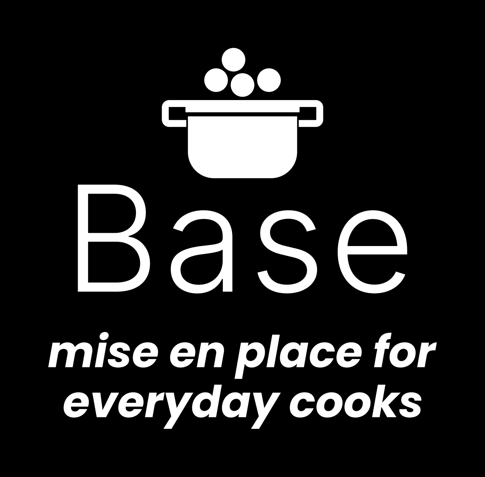

# Base — Logo

**Base** · *mise en place for everyday cooks*

## The idea

A pot — the base of food — with four bubbles rising out of it. The four bubbles are the four corners of a strong base: three resting on the lid with the centre one lowest, and a fourth lifting off between them.

This is a clean vector redraw of the original sketch. The composition is unchanged; the geometry is tidied: true circles, one even gap between every bubble and the lid, symmetric bracket handles fused to the lid, and a single thin gap line between lid and pot.

The wordmark is "Base" in Inter Light, lightly tracked (+30), converted to outlines. The tagline is Poppins Bold Italic, lowercase, set on two lines in the stacked lockup and one line in the horizontal lockup.

## Construction

Units are pixels of the original sketch.

| Element | Size |
| --- | --- |
| Pot body | 134 wide × 76 tall, bottom corner radius 32 |
| Lid | 140 wide × 15 tall, sitting 5 above the body |
| Handles | 29 out × 33 tall, 8.5 stroke, open toward the pot |
| Bubbles | radius 14.5, gap 4 between bubbles and to the lid; side bubbles lifted 6 above the centre one |

Minimum clear space: one bubble diameter. Minimum size: mark 20 px, stacked lockup 120 px wide.

## Colour

Black `#000000` and white `#FFFFFF`. The logo is always one colour.

## Files

All SVGs are outlined (no font dependency). PNGs are 2× (the mark is exported larger).

| Asset | Files |
| --- | --- |
| Stacked lockup (primary) | `base-lockup-stacked*` |
| Stacked, no tagline | `base-lockup-stacked-notag*` |
| Horizontal | `base-lockup-horizontal*` |
| Horizontal with tagline | `base-lockup-horizontal-tag*` |
| Wordmark | `base-wordmark*` |
| Mark | `base-mark*` |
| App icon (1024) | `base-app-icon` |
| Favicon | `base-favicon` |

Suffixes: none = black on transparent · `-inverse` = white on transparent · `-on-ink` = white on black · `-on-paper` = black on white.

To regenerate everything: `python3 brand/tools/build_logo.py` (needs `fonttools`, `matplotlib`, Inter and Poppins installed).
