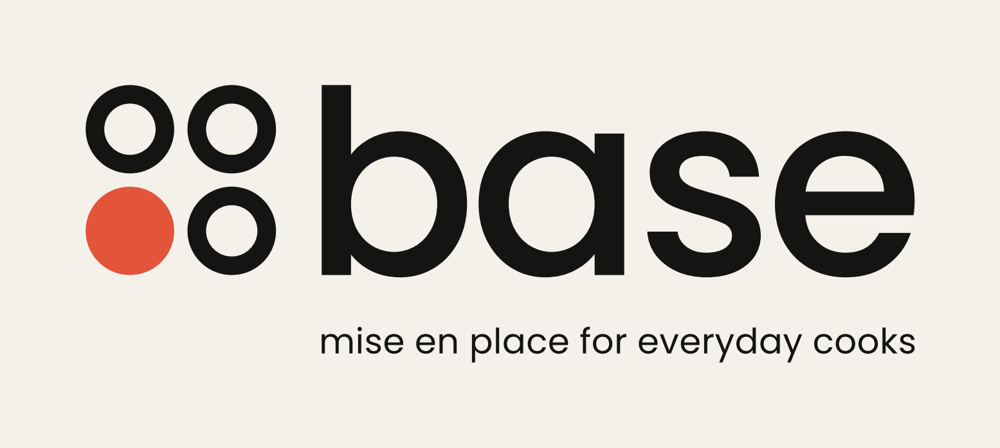
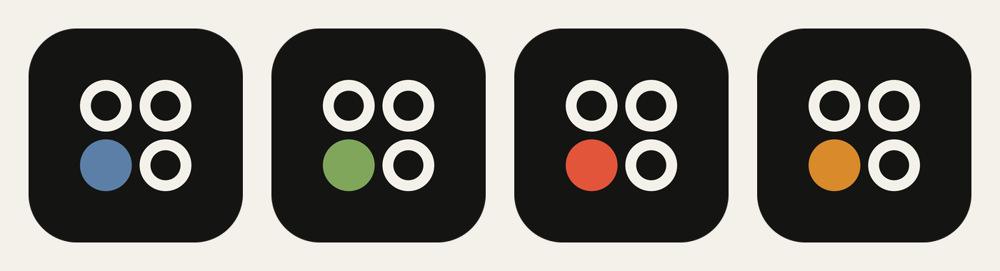

# Base — Logo

**base** · *mise en place for everyday cooks*

## The idea

Four prep bowls, seen from above. Mise en place, drawn as simply as it can be.

- **Four bowls** for the four layers of Base: Foundation, Expression, Community, Pickup.
- **One is filled:** this week's Base. It sits bottom-left, the bowl at the *base* of the mark, so the whole thing reads as a foundation with room to build on.
- **It's a system, not just a symbol.** The filled bowl changes colour with the season, so the brand moves through the year the way the weekly basket does.

The round bowls rhyme with the round letters of the wordmark: "base" in lowercase Poppins Medium, tracked −30, converted to outlines. The tagline is Poppins Regular, lowercase, set to the width of the wordmark.

## Construction

Units: bowl radius = 1.

| Element | Size |
| --- | --- |
| Bowls | 4 circles of radius 1 on a 2 × 2 grid |
| Gap between bowls | 0.30 |
| Ring thickness (empty bowls) | 0.42 (0.50 in the favicon) |
| Horizontal lockup | mark height = height of the "b" ascender, sitting on the baseline |
| Stacked lockup | mark at 1.35× the horizontal size, centred above the wordmark |

Clear space: one bowl radius on every side. Minimum size: mark 16 px, horizontal lockup 90 px wide.

## Colour

| Name | Hex | Use |
| --- | --- | --- |
| Ink | `#141413` | Logo, text, dark grounds |
| Paper | `#F4F1EA` | Light grounds, logo on dark |
| Tomato | `#E2553A` | Signature colour — the filled bowl only |

Seasonal fills for the filled bowl:

| Winter | Spring | Summer | Fall |
| --- | --- | --- | --- |
| `#5B7FA6` | `#7FA65B` | `#E2553A` | `#D98A2B` |

Only the filled bowl ever takes colour. Don't recolour the rings or wordmark, add effects, rearrange the bowls, or re-set the wordmark in another typeface.

## Files

All SVGs are outlined (no font dependency). PNGs are 2× (the mark is exported larger).

| Asset | Files |
| --- | --- |
| Horizontal lockup (primary) | `base-lockup-horizontal*` |
| Horizontal with tagline | `base-lockup-horizontal-tag*` |
| Stacked lockup | `base-lockup-stacked*` |
| Stacked, no tagline | `base-lockup-stacked-notag*` |
| Mark | `base-mark*` |
| Wordmark | `base-wordmark*` |
| App icon (1024) | `base-app-icon`, `-color`, `-winter`, `-spring`, `-summer`, `-fall` |
| Favicon | `base-favicon` |

Suffixes: none = ink on transparent · `-inverse` = paper on transparent · `-on-paper` / `-on-ink` = one colour on a ground · `-color` = tomato bowl on paper · `-color-on-ink` = tomato bowl on ink.

To regenerate everything: `python3 brand/tools/build_logo.py` (needs `fonttools`, `matplotlib` and Poppins installed).
